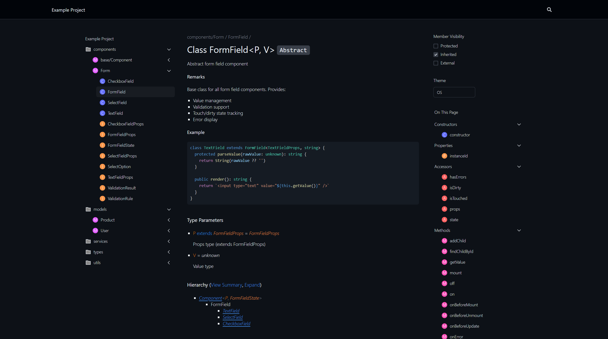

<h1 align="center" style="margin-top: 2rem">TypeDoc RhineAI Theme</h1>

<p align="center">
  <strong>A carefully designed, detail-refined GitHub-style TypeDoc theme.</strong>
</p>

<p align="center">
  <a href="https://www.npmjs.com/package/typedoc-rhineai-theme">
    
  </a>
  <a href="https://www.npmjs.com/package/typedoc-rhineai-theme">
    
  </a>
  <a href="https://github.com/RhineAI/typedoc-rhineai-theme/blob/main/LICENSE">
    
  </a>
  <a href="https://github.com/RhineAI/typedoc-rhineai-theme">
    
  </a>
</p>

<p align="center">
  <a href="#features">Features</a> •
  <a href="#preview">Preview</a> •
  <a href="#installation">Installation</a> •
  <a href="#usage">Usage</a> •
  <a href="#contributing">Contributing</a> •
  <a href="#license">License</a>
</p>


## Features

- **GitHub-Style Design** - Clean, familiar interface inspired by GitHub's documentation style
- **Dark Mode Support** - Automatic theme switching based on system preferences
- **Responsive Layout** - Works seamlessly on desktop, tablet, and mobile devices
- **Syntax Highlighting** - Beautiful code blocks with language-specific highlighting
- **Zero Configuration** - Works out of the box with sensible defaults
- **Fast & Lightweight** - Optimized for performance with minimal bundle size

## Preview

<p align="center">
  <a href="https://typedoc.rhineai.com/example/classes/components_base_Component.Component.html">
    
  </a>
</p>

<p align="center">
  <a href="https://typedoc.rhineai.com/example/classes/components_base_Component.Component.html">View Live Demo</a>
</p>

## Installation

```bash
# Using npm
npm install typedoc-rhineai-theme --save-dev

# Using yarn
yarn add typedoc-rhineai-theme --dev

# Using pnpm
pnpm add typedoc-rhineai-theme --save-dev

# Using bun
bun add typedoc-rhineai-theme --dev
```

### Requirements

- Node.js >= 18.0.0
- TypeDoc ~0.28

## What is TypeDoc?

[TypeDoc](https://typedoc.org/) is a documentation generator for TypeScript projects. It reads your TypeScript source code and JSDoc comments, then generates static HTML documentation automatically.

If you're new to TypeDoc, visit [typedoc.org](https://typedoc.org/) to learn how to get started.

## Usage

### Basic Setup

Add the theme to your `typedoc.json` configuration file:

```json
{
  "$schema": "https://typedoc.org/schema.json",
  "name": "My Project",
  "entryPoints": ["./src"],
  "out": "./doc",
  "plugin": ["typedoc-rhineai-theme"]
}
```

Then run TypeDoc:

```bash
npx typedoc
```

### Command Line Usage

You can also use the theme directly from the command line:

```bash
npx typedoc --plugin typedoc-rhineai-theme --entryPoints ./src --out ./doc
```

### Programmatic Usage

```typescript
import { Application } from 'typedoc';

const app = await Application.bootstrap({
  entryPoints: ['./src'],
  plugin: ['typedoc-rhineai-theme'],
});

const project = await app.convert();
if (project) {
  await app.generateDocs(project, './doc');
}
```

## Development

### Prerequisites

- [Bun](https://bun.sh/) - Fast JavaScript runtime and package manager

### Setup

```bash
# Clone the repository
git clone https://github.com/RhineAI/typedoc-rhineai-theme.git
cd typedoc-rhineai-theme

# Install dependencies
bun install

# Build the project
bun run build
```

### Scripts

| Script | Description |
|--------|-------------|
| `bun run build` | Compile TypeScript to JavaScript |
| `bun run example` | Build and preview the example documentation |
| `bun run type:check` | Run TypeScript type checking |
| `bun run lint` | Run ESLint and fix issues |
| `bun run lint:check` | Run ESLint without fixing |
| `bun run format` | Format code with Prettier |
| `bun run format:check` | Check code formatting |

### Project Structure

```
typedoc-rhineai-theme/
├── src/                    # Source code
│   ├── assets/            # Theme assets (CSS, JS)
│   ├── partials/          # JSX template partials
│   ├── public/            # Static files (favicon, manifest)
│   ├── index.tsx          # Plugin entry point
│   └── rhineai-theme.tsx  # Theme class definition
├── example/               # Example project for testing
├── doc/                   # Generated documentation output
├── dist/                  # Compiled output
└── package.json
```

## Issues
1. Due to our overly aggressive UI-aesthetics-first approach, we have hidden all scrollbars. If needed, you can fork this repository and modify the CSS.
2. Not fully tested yet, and it is still unclear whether it works well across all projects and in all UI scenarios. If you encounter any issues, please open an issue.
3. More suitable for dark themes.

## Contributing

We welcome contributions! Here's how you can help:

1. **Fork** the repository
2. **Create** a feature branch (`git checkout -b feature/amazing-feature`)
3. **Commit** your changes (`git commit -m 'Add amazing feature'`)
4. **Push** to the branch (`git push origin feature/amazing-feature`)
5. **Open** a Pull Request

### Guidelines

- Follow the existing code style
- Write clear commit messages
- Update documentation as needed
- Add tests for new features when applicable

## License

This project is licensed under the MIT License - see the [LICENSE](LICENSE) file for details.

## Acknowledgments

- [TypeDoc](https://typedoc.org/) - The documentation generator this theme is built for

---

<p align="center">
  Made by <a href="https://github.com/RhineAI">RHINE.AI</a>
</p>
