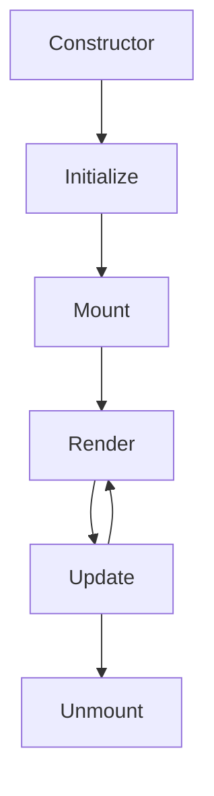

# Components

Reusable UI components built with TypeScript.

## Base Component

All components extend the `Component` base class:

```typescript
import { Component } from './base/Component';

class MyComponent extends Component {
  render() {
    return `<div>${this.props.content}</div>`;
  }
}
```

## Form Component

The `Form` component provides:

- Field validation
- Error handling
- Submit management

### Example

```typescript
const form = new Form({
  fields: [
    { name: 'email', type: 'email', required: true },
    { name: 'password', type: 'password', minLength: 8 }
  ],
  onSubmit: async (data) => {
    await api.post('/login', data);
  }
});
```

## Component Lifecycle



## Creating Custom Components

1. Extend `Component` base class
2. Implement `render()` method
3. Override lifecycle methods as needed

See [base/Component](./base/README.md) for more details.
